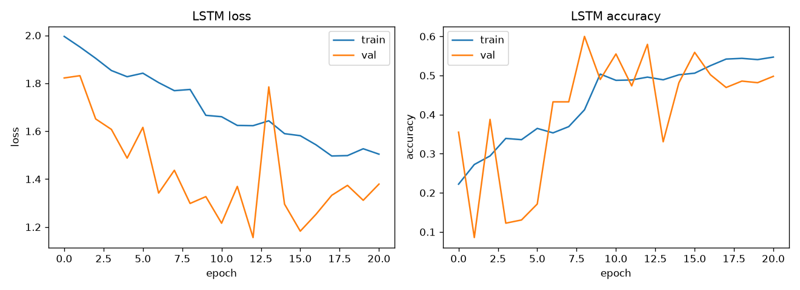
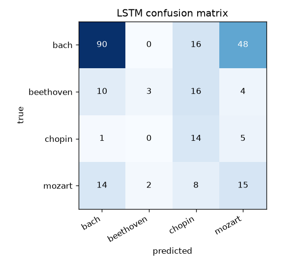
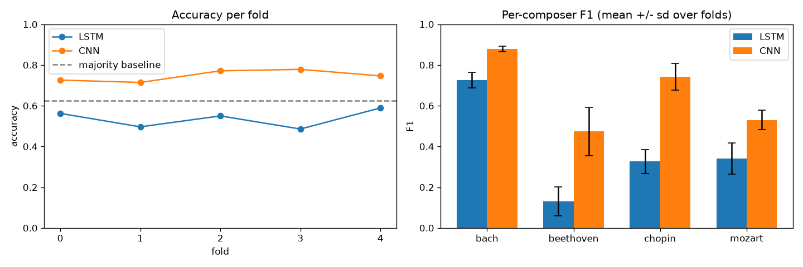

# LSTM model — architecture, training, and results

Companion to [`methodology-decisions.md`](methodology-decisions.md), which has the full defect log. This is the report-facing summary: what the model is, how it was trained, and what it scored.

## Architecture

Two inputs, because pitch is categorical and the other three note features are not:

- **Pitch** — `Embedding(128, 16, mask_zero=True)`. MIDI note number fed as an integer, not scaled to `[0, 1]`; a composer's harmonic language lives in pitch-class intervals, not in absolute pitch height as a magnitude.
- **Duration, velocity, offset** — fed as continuous features, concatenated with the pitch embedding at every timestep.

Layer stack, after the two inputs are concatenated per timestep:

1. `Concatenate` — pitch embedding (16) + continuous (3) → (500, 19)
2. `LSTM(128, return_sequences=True)`
3. `Dropout(0.3)`
4. `LSTM(64)`
5. `Dropout(0.3)`
6. `Dense(4, softmax)`

Sequences are the first 500 note events per piece (~50 seconds at the median; see limitations), zero-padded/masked. Loss is sparse categorical cross-entropy; optimizer is Adam, lr `5e-4`, `clipnorm=1.0` (gradient clipping — see defect log 1.2). Class weights come from the **unaugmented** training counts, since augmentation already rebalances the raw 7.5:1 Bach:Chopin ratio.

Training uses `EarlyStopping(monitor="val_accuracy", patience=12, restore_best_weights=True)` and `ReduceLROnPlateau` (factor 0.5, patience 4). Two different epoch budgets apply: the **single-split** run is capped at 100 epochs (it early-stopped at epoch 21, batch 32, seed 42), while the **cross-validation** folds use a 60-epoch cap per fold — the cap the limitations section refers to.

## Results

**Single split** (`data/splits/` — file-level, has the work-leakage described in the methodology doc):

| Metric | Value |
|---|---|
| Accuracy | 0.488 |
| Macro precision | 0.512 |
| Macro recall | 0.323 |
| Majority-class baseline | 0.626 |

**Work-grouped 5-fold cross-validation + holdout** (`data/splits_grouped/` — no piece shares a work across folds):

| Metric | Value |
|---|---|
| CV accuracy | 0.554 ± 0.062 |
| CV macro F1 | 0.409 ± 0.062 |
| Holdout accuracy | 0.453 |
| Holdout macro F1 | 0.426 |
| Holdout macro precision / recall | 0.473 / 0.498 |
| Majority-class baseline | 0.624 |

Per-fold accuracy: 0.630, 0.475, 0.614, 0.493, 0.557.

Holdout per class:

| Composer | Precision | Recall | F1 | n |
|---|---|---|---|---|
| Bach | 0.91 | 0.42 | 0.57 | 146 |
| Beethoven | 0.26 | 0.19 | 0.22 | 32 |
| Chopin | 0.50 | 0.68 | 0.58 | 19 |
| Mozart | 0.22 | 0.70 | 0.34 | 37 |

**The LSTM does not beat the majority-class baseline on any measure.** The dominant error is 76 of 146 Bach files predicted as Mozart — Bach precision 0.91 against recall 0.42 says the model is right when it commits to Bach and mostly doesn't commit.

## Known limitations

Full detail in the methodology doc's [section 5](methodology-decisions.md#5-known-limitations). The headline items:

1. Only the first ~50 seconds of each piece is used (500 note events).
2. The model is not converged — three of five CV folds hit the 60-epoch cap while still improving, so "sequence models underperform here" is not yet a supported conclusion.
3. No non-deep baseline exists to check whether the model earns its complexity over, e.g., a pitch-class histogram + logistic regression.
